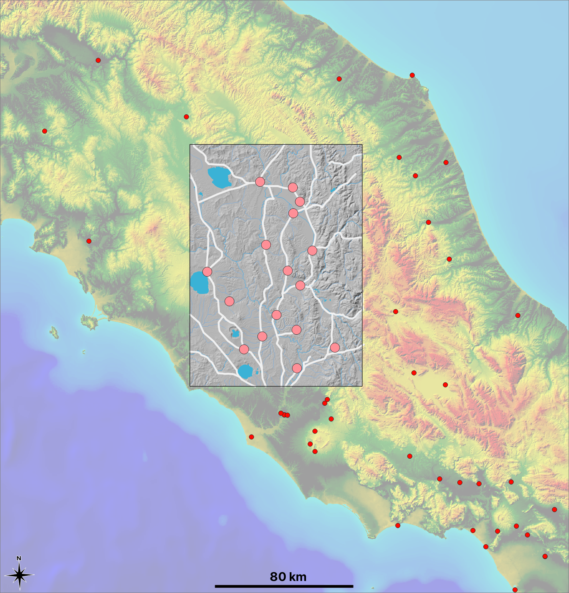
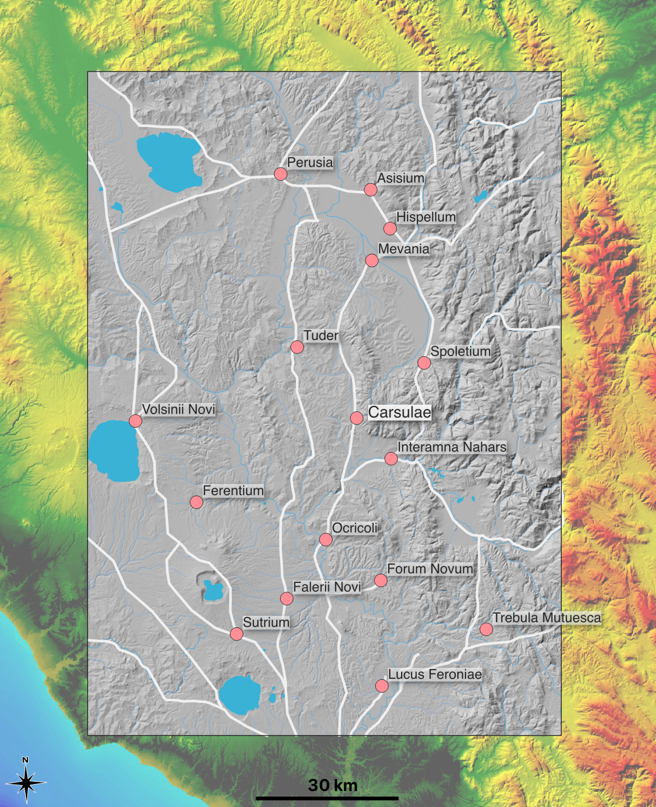
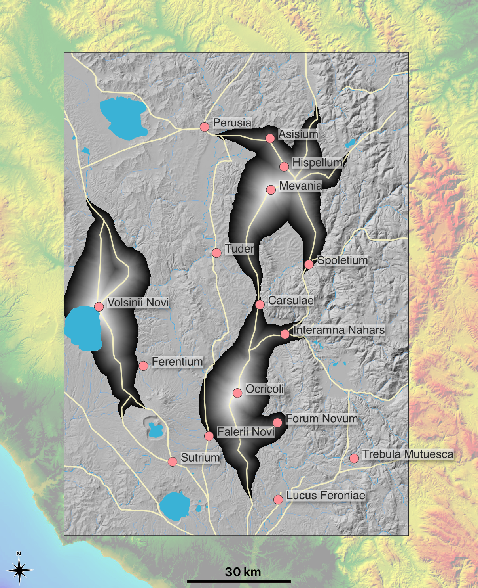
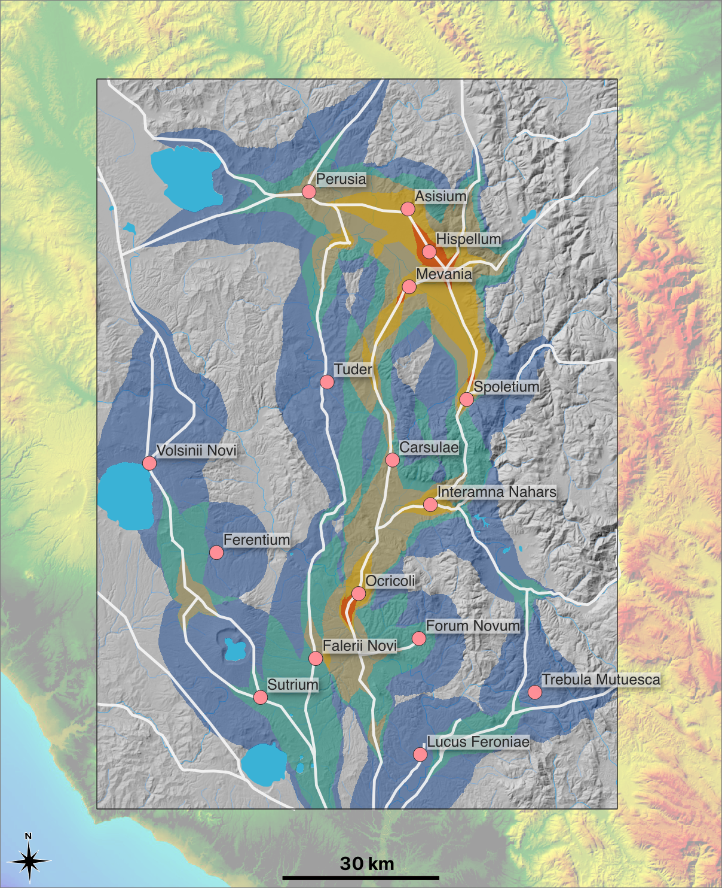

# Mapping Movement and Diverse Experiences Between Amphitheaters North of Rome

Sebastian Heath

_Received &lt;Month> &lt;Day> 2023_

Citation: Heath, Sebastian 'Mapping Movement and Diverse Experiences Between Amphitheaters North of Rome' _Epoieson_ (if I'm so lucky!)

## Introduction

Making maps that evoke past experiences in the territory around and between sixteen amphitheaters north of Rome lies at the core of this paper, and in that regard it is a digital exercise. As the digital mapping proceeds, finding diversity within human experiences will be connected to exploring the role of amphitheaters in the Roman Empire. From that perspective this paper is also about the connection between specific digital resources and open-ended historical analysis. To rephrase that theme as a question: can we read human behavior into digital surrogates for the landscape in which those behaviors might have taken place? The answer ought to be at least a qualified yes. If it were a firm no, I wouldn't burden readers with all the words that follow. And a no would also mean ignoring existing efforts that have created useful frameworks for exploring group and individual experience using digital tools [@gillingsLandscapePhenomenologyGIS2012; @susmannRegionalWaysSeeing2020]. But I don't mean to say that the end result of making digital maps should be any sense of having reached definite conclusions. Neither maps nor other visualization need bear that burden [@druckerHumanitiesApproachesGraphical2011; @whiteWhatSpatialHistory2010]. Accordingly, the visuals shown here provide no discrete and finished answers to any of the questions that can arise from engaging with them. Instead, they are primarily responsive to my thoughts and queries as the author and I hope that they encourage further questioning. I will be transparent about process and by that mean to be clear that that I am not asking more of the collected data than they can bear. And transparency is a form of invitation: An invitation to speculate on how other approaches and evidence could overlap with what I present. One overall perspective adopted here is that digital representations are clearly simplifications of past phenomena so that it is easy to identify their shortcomings. To adapt the aphorism often attributed to the statistician George Box, “All GIS layers are wrong, but some are useful.” [@AllModelsAre2022] Placing this observation at the center of describing technical process can shift the discovery of diversity and complexity to the viewer, by which term I again mean both myself as author and any readers.

Amphitheaters in general and the Flavian Amphitheater in Rome - aka The Colosseum - in particular exist in both contemporary public perception and scholarly conventional wisdom as a symbol of Roman achievement [@hopkinsColosseum2005; @elkinsMonumentDynastyDeath2019]. And it is very reasonable to suggest that amphitheaters can promote a typical, repeated, and expected ancient experience that contributes to seeing the Roman imperial state as a coherent cultural and political entity [@norenaEarlyImperialMonarchy2010]. At any scale of analysis, however, amphitheaters also promoted diversity of experience and reaction [@faganLureArenaSocial2011]. This diversity is of course quite extreme when considering the juxtaposition of the audience and those involved, willingly or not, in the violent entertainment on display. While the experiences of each are certainly bound together, the stark difference between them, as well as the risk of that separation breaking down, is part of what makes the entertainment work [@bomgardnerMageriusMosaicRevisited2009; @colemanFatalCharadesRoman1990; @tuckSpectacleIdeologyRelief2007].

Considering all of Roman territory, it is important to stress that amphitheaters were not evenly distributed within this large area (Figure 1). They are more concentrated in Italy and the nearest part of North Africa than anywhere else in the empire [@heathEstimatingMappingRoman2022]. That observation by itself is enough to say that amphitheaters did not on their own create an equal experience of empire everywhere. Though noting this variation is an opportunity to emphasize that all the activities that took place within amphitheaters - animal hunts and fights, executions by various means, and gladiatorial combat - also took place in other physical settings and that all were to some extent aspects of the Roman imperial system wherever it is found.

Chronology also matters. There are approximately 20 amphitheaters built before and by the time of Julius Caesar's veteran settlements, the planning and realization of which occasionally included an amphitheater [@welchRomanAmphitheatreIts2009]. Over 260 of these structures were in use during the 2nd Century, though already by the end of that century amphitheaters are being abandoned, or at least repurposed [@heathNearnessExperienceNetwork2023, p. 141]. This means that the 2nd Century can be considered the time of "Peak Amphitheater". The years from the reign of Trajan, through that of Hadrian and into those of Antoninus Pius and then Marcus Aurelius likely saw both the most amphitheaters in use at any one time and the last substantial phase of construction [@bomgardnerStoryRomanAmphitheatre2000, p. 386].

While the changing distribution of amphitheaters is worth consideration on its own terms, this article looks to a period of relative stability and defines a computationally manageable area of study in which to examine how the presence of amphitheaters in a specific region could have contributed to localized diversity of access and experience. The general region of interest here is the area north of Rome to just beyond Perusia (modern Perugia) and the particular focus is the area distinguished by the presence of sixteen amphitheaters (Fig. 3, Table 1) that are mostly found in medium size and smaller towns that are themselves all established by the second century CE, with most being much older. By constructing a digital context that supports a local and regional perspective on interaction between these amphitheaters, settlements of varied types, and rural areas, what follows will highlight the productive tension between shared infrastructure and diverse experience in this core area of the Roman world. Access matters and the relative availability of the experience of being in an amphitheater can be tentatively mapped. Seeing where availability was high - where regional inhabitants could visit many amphitheaters - in turn implicates the atmosphere within those venues. In which of these structures was one most likely to be sitting next to someone who lived elsewhere, whether in a town or in the countryside? As a visitor to a town, were you sitting next to a visitor from another town? How might that effect interactions within the crowd. The stakes could, of course be high. As when riots broke out between locals and visitors from Nuceria in 59 CE at Pompeii (Tacitus, *Annales*, XIV.17). But that was an unusual event, as shown by the imperial attention that it brought. It is diverstiy with usual behavior that is of greater concern.

The maps here also bring attention to the areas between amphitheaters, which is a very intentional feature. Amphitheaters attract spectators, but those spectators also return home. When they do that, what is the likelihood that they find themselves in conversation with someone who had been at an event at yet another town? Such a question takes us deep into speculative territory. This paper is only a start that uses digital mapping to identify very local contexts in which overlapping movement might have been relatively intense or relatively absent and how that might have affected both experience in amphitheaters and in the areas between them. 

<!-- A central observation is that the existence of an infrastructure for a collective experience, in this case amphitheaters, does not mean that there weren't many perspectives within the communities sharing that experience. The more people who can come together, the greater likelihood that assembled groups contain individuals with distinct experiences and reactions. This approach is informed by recent work that places individual experience at the center of the study of the Roman world. [@huemoellerFreedomMarriageManumission2020; @joshelGeographiesSlaveContainment2013; @norenaIntroduction2019]. -->

## Mapping Amphitheaters
The primary digital method this paper employs is GIS-based cost-surface analysis of the terrain surrounding the sixteen selected amphitheaters. As noted, the focus is the 2nd century CE and that time period is meant to span the relative stability of the imperial period. There is of course dynamism during these years. [@pattersonChangingLandscapesRome2020, p. 201; @attemaRomanHinterlandProject2022]. The civil wars of the late 60s CE had caused disruption and the arrival of plague in the mid-2nd played out across this region [@duncan-jonesImpactAntoninePlague1996, p. 125]. But from the perspective of town formation, the laying of roads, and, yes, amphitheater construction, all these pieces are largely in place by the late 1st century CE and they then persisted through the 2nd and into the early 3rd before local and external events mean that new patterns of interaction and behavior would probably have to be considered [@pattersonChangingLandscapesRome2020, p. 208]. 

With the chronological scope in place and the area of interest introduced, collecting digital resources will lead to generating a map that categorizes the study area by how many amphitheaters lie within a digitally calculated 8-hour walking distance of any one point. That visualization appears below as Figure 6. The next paragraphs here present a description of what data was collected, how it was adapted, and how it was processed in order to make that map. Once Figure 6 is in place, some of the questions that it raises - or at least a few of the questions that I raised to myself - will be used to engage further with the dialog between digital representation and historical analysis. That dialog will itself make use of the interactive map that appears as Figure 7.

Figure 2 is an overview of the study area within the context of central Italy. The underlying base map is made available by the Italian Volcanological Institute and is their rendering of their freely available [10-meter Digital Elevation Model (DEM)](https://tinitaly.pi.ingv.it) that covers all of modern Italy [@tarquini10mresolutionTINITALYTransdisciplinary2017a]. This DEM uses the UTM32N grid ([EPSG:32632](https://epsg.io/32632)) so that I also adopt that coordinate reference system (CRS) for the other GIS layers in this study. The area of particular interest - within which cost surfaces will be calculated - is indicated in gray and by my own rendering of that part of the same DEM. Outside that area, amphitheater locations are shown in red. Inside the area, amphitheater locations are shown with larger pink markers. Noting this color-difference is an opportunity to be direct about my most explicit authorial intervention in this project. I chose the study area because it contains sixteen amphitheaters that seemed to make a reasonably coherent spatial group. And being even more clear, I judged this grouping by eye and without the assistance of any clustering algorithm. This approach seemed reasonable given the evident spacing between these sixteen amphitheaters and those lying to the west, north, and east. All of those structures are definitely more than an 8-hour walk away. The overlapping dots below the southeast corner represent the public amphitheater at Tibur and the small private arena at Hadrian' villa at Tivoli (if one accepts that there was such a structure). Again, it was a judgement call to set the southern edge of the study area so that they are not included. It was also a judgement call not to include the towns of Ameria, Fulginae, and Urvinum Hortense as locations of amphitheaters (see figure 7 for where they would have been marked). The evidence at each is ambiguous at best [@tosiEdificiSpettacoliNell2003]. Rome lies to the south and its approximate location is indicated by the overlapping dots that represent the Flavian Amphitheater, the nearby Ludus Magnus, and other later amphitheaters in the capital. That Rome's near one million inhabitants are so close will be part of the discussion below, even if my focus is the more local effect of the sixteen amphitheaters that defined the study area. All the amphitheater locations come from a [dataset](https://github.com/roman-amphitheaters/roman-amphitheaters) that I maintin and which is available on the code and data sharing site GitHub.

The final layer included in this overview and in many of the maps that follow represents Roman-period roads. This layer also required substantial intervention by me. The Ancient World Mapping Center at the University of North Carolina makes available an ESRI shapefile of ancient roads in the Graeco-Roman world. Like many of the other spatial resources there, it is drawn originally from the maps created for the the *Barrington Atlas of Classical Sites* (BAtlas). This was an excellent starting point. When adding missing routes, I used the Roman-period itineraries available on the site [topostext.org](http://topostext.org) and the "Reference Map of Ancient Italy. Northern Part" map in the 1926 5th edition of William Shepherd's *Historical Atlas* to add in additional routes [@shepherdHistoricalAtlas1926, pp. 26 & 27]. These are specific resources that complement more general discussions [@laurenceRoadsRomanItaly1999; @olshausenRoadsRoutesImperium2010]. (It's a bit of a forward jump, but I note now that the interactive map in Figure 7 can be used to identify my additions.) Even after this work, this digital representation should not be taken as any final word on the built infrastructure for Roman-period movement within the study area. My intent is that it be dense enough to model movement along major routes with reasonable confidence that the results speak to the differing levels of access to the amphitheaters in the region. It is the case that a missing branch of a Roman road will affect the results within specific parts of the maps that follow. But overall, I believe this layer is sufficiently representative to raise the issue of differing access and to encourage observations that take the issue into account. It is “wrong” but I do consider it “useful”.

Figure 3 narrows the focus and adds labels to each amphitheater. It also adds major bodies of water and the paths of rivers, likewise downloaded from the AWMC. As with the roads, these will be part of the coming cost surface analysis. This map does draw attention to the individual amphitheaters and Table 1 provides summary information for each of these. In general, these sixteen structures are fairly typical medium-sized amphitheaters in medium-sized towns. We are outside the world of the mega-sized buildings such as the Flavian Amphitheater in Rome. That example is conventionally estimated to have held 50,000 spectators. These are all also smaller than the next tier of large structure such as the amphitheaters at Capua, Verona, Pula, Arles, and Nimes, to name just a few. Looking at Figure 3, it is immediately clear that all are on or very close to the network of roads as represented here [@emmersonLifeDeathRoman2020, p. 179]. That is a primary observation that contributes to essentially all aspects of this study. Again invokinig transparency, I did create a road from the *Via Flaminia* to Forum Novum, which is plausible given the results of the magnetometry at the site that also identified an amphitheater there [@gaffneyForumNovumVescovio2001].

| Latin Toponym    | Mod. Toponym           | No. Within 8 Hour Walk | Date            | Dimensions    | Est. Capacity | Golvin; Tosi; Welch                       | Amphitheatrum Link                          |
|------------------|------------------------|------------------------|-----------------|---------------|---------------|-------------------------------------------|---------------------------------------------|
| Asisium          | Assisi                 | 2                      | 1st CE          | ?x? , 60x35   |               | Golvin, p. 252; Tosi, p. 353              | [link](https://amphi-theatrum.de/1386.html) |
| Carsulae         | Carsoli                | 2                      | Late 1st CE     | 87x62, 62x37  | 6000          | Golvin, no. 80; Tosi, p. 356              | [link](https://amphi-theatrum.de/1512.html) |
| Falerii Novi     | Santa Maria in Falleri | 2                      | 1st CE          | 88x66, 54x33  | 8000          | Golvin, no. 146; Tosi, p. 409             | [link](https://amphi-theatrum.de/1545.html) |
| Ferentium        | Ferento                | 0                      | Late Republican | 68x40 , ?x?   |               | Golvin, no. 9; Tosi, p. 410; Welch no. 16 | [link](https://amphi-theatrum.de/1470.html) |
| Forum Novum      |                        | 1                      | 1st CE          | ?x?, 45x25    | 2000          | n/a                                       | n/a                                         |
| Hispellum        | Spello                 | 3                      | 1st CE          | 82x?, ?x?     | n/a           | Golvin, p. 252; Tosi, p. 361              | [link](https://amphi-theatrum.de/1595.html) |
| Interamna Nahars | Terni                  | 3                      | 1st CE          | 95x73, 65x36  | 11000         | Golvin, no. 144; Tosi, p. 366             | [link](https://amphi-theatrum.de/1401.html) |
| Lucus Feroniae   | Fiano Roman            | 0                      | Julio-Claudian  | 46x44 , 34x32 | 1850          | Golvin, no. 145; Tosi p. 421              | [link](https://amphi-theatrum.de/2923.html) |
| Mevania          | Bevagna                | 3                      | 1st CE          | 80x53, 44x24  | 7000          | Golvin, no. 282; Tosi, p. 370             | [link](https://amphi-theatrum.de/1596.html) |
| Ocriculum        | Otricoli               | 4                      | Julio-Claudian  | 120x98, 64x42 | 18000         | Golvin, no. 142; Tosi, p. 375             | [link](https://amphi-theatrum.de/1542.html) |
| Perusia          | Perugia                | 4                      | Imperial?       | ?x?, ?x?      | -             | Golvin, p. 254; Tosi, p. 429              | n/a                                         |
| Spoletium        | Spoleto                | 3                      | 1st CE          | 115x85, ?x?   | -             | Golvin nos. 86 and 169; Tosi, p. 381      | [link](https://amphi-theatrum.de/2681.html) |
| Sutrium          | Sutri                  | 1                      | Late Republican | 77x?, ?x?     | -             | Golvin no. 8; Tosi, p. 433; Welch no. 15  | [link](https://amphi-theatrum.de/1469.html) |
| Tuder            | Todi                   | 0                      | Uncertain       | 90x60         | -             | Golvin, p. 253; Tosi, p. 387              | [link](https://amphi-theatrum.de/1400.html) |
| Trebula Mutuesca | Monteleone             | 0                      | 2nd CE?         | ?x?, ?x?      | “small”       | Golvin,  no. 58; Tosi, p. 312             | [link](https://amphi-theatrum.de/1504.html) |
| Volsinii Novi    | Bolsena                | 0                      | Flavian         | 100x84, 58x42 | 11,000        | Golvin no. 163; Tosi p. 442               | [link](https://amphi-theatrum.de/1554.html) |

Table 1: The 16 sixteen amphitheaters in the study region. References are to [@golvinAmphitheatreRomainEssai1988; @tosiEdificiSpettacoliNell2003; @welchRomanAmphitheatreIts2009]. When available, the links to amphitheatrum give further bibliography and often have images.

With topography, lakes and waterways, amphitheaters, and roads digitally represented, cost surface analysis can be pursued. Figure 4 shows a partial result that is a precursor to creating figure 6. It displays calculated 8-hour walking zones for the amphitheaters at Mevania, Ocriculium, and Volsinii Novi. They are shaded to indicate increasing time and the edges of each zone suggest how far one could walk, both along roads and into the surrounding landscape, in that amount of time. Each zone was calculated by running the r.grass.walk module within QGIS, the widely-used open-source Geographic Information System.

While only including a sample of such zones, Figure 4 already indicates that these three amphitheaters were not within an 8-hour walk of each other. It is the case that there is very slight overlap between the 8-hour zones of Mevania and Ocriculum. This occurs just north of the amphitheater at Carsulae. If we allow for some flexibility in deriving past experience from these digital maps, it was loosely the case that the inhabitants of Carsulae were within a day's walk of the towns of Mevania and Ocriculum each of which lay approximately 30km away on the *Via Flaminiae*. And perhaps they would choose to make journey that if, as likely, there was no event scheduled the amphitheater in their own town but they knew of one taking place to the north or south [@benefielRegionalInteractionLocal2016, p. 446]. I do not mean to be speaking in absolute terms about these calculated zones and the experiences they suggest. Adopting the approach described in the introduction, this map illustrates the point that as one moved through or even lived in different parts of this area, one had varying access to more-or-less local amphitheaters. Someone living between Carsulae and Mevania was closer than 8 hours to both. That is an obvious point but this map suggests that the concept can be illustrated by digital means. The map also includes the locations of other amphitheaters and so shows all the other amphitheaters lay within the 8-hour zone of these three structures. Noting this moves further towards the issue of regional-scale interaction that is the motivating idea here. But some more explanation of computational process is in order.

Cost surface analysis is a well established technique implemented by many GIS applications [@herzogSpatialAnalysisBased2020; @lewisProbabilisticModellingIncorporating2021]. Writing generically, by assigning a cost - whether time or, perhaps, calories - to move through any point on a surface - and for this study the surface is a landscape - the accumalated cost of moving between two specific points can be calculated. The closely related concept of “Least Cost Path” is the additional step of determining of the many possible paths between two points, which one imposes the lowest total cost. Staying within the context of this study, the time it takes for a person to walk between points is the unit of cost used. In general, I'll state that in hours. And while the final result takes account of an accumulation of inputs, the initiaL input for determing cost of movement at any one point is the digital elevation model. Flat areas are potentially easier to move through. And in the context of a DEM, "flat" means that two sampled points are at nearly the same elevation. Sloping land slows down walking, therefore increasing the time cost in seconds, and increasing slope slows down walkers even more. The connection to human behavior is made more intimate by making steep downward slopes the most costly to traverse. This means that routes can have different costs in time depending on the direction of travel. While it remains a constant concern that the comnbination of inputs and algorithm can only remain a proxy for human behavior, it is useful that testing against early modern itineraries as well as ancient evidence has in general confirmed our modern ability to digitally estimate walking distances across Mediterranean landscapes so long as the numbers are supplemebted by reasonable judgement and accomodation to the limts of our evidence [@bevanTravelInteractionGreek2013;@seifriedReconstructingHistoricalJourneys2019].

All landscapes have variability as to the cost in time of moving through its different parts. This often is the result of a myriad of small scale phenomena such as forest, brush, or other changing overgrowth along with more permanent aspects such as stone and boulders as well as larger and smaller waterways, which can themselves by seasonal. It is not possible - or rather, not practical within the scope of my current work - to model all this variablity with digital tools. As noted above, this study attempts to bring enough factors so that the maps it presents can be said to take account of surface variability while also prompting readers to complement this visual content with their own understanding of how additional factors might affect the discussion here.

![Figure 5: Rendering of elements of the friction raster laid over a “hillshade” rendering of topography. Red for rivers (10 additional seconds per meter), green for roads (0), Gray for lakes (10,000 so effectively impassable), and yellowish-green for all other areas (2). Amphitheater locations in pink. Rivers are emphasized so that they are visible at this scale. Readers should note that the “hillshade” effect is not actually part of the GIS layer, which only records the four values for river, lakes, roads, and all other pixels.](heath-supporting-images/heath-05-friction.png)

Within the context of GIS-based cost surface analysis, the primary method for introducing variable cost arising from factors other than slope is to create a so-called "friction" surface. This can be described most simply as the assigment of additional cost in seconds to move through any point in the landscape. Figure 5 is a rendering of the friction map that this study uses. In generating it, one assumption was that Roman roads, shown in green, add no additional cost. They are easy to walk along and slope is the only terrain-based factor making that can slow someone down. Water is hard to pass so that a 10 second penalty per meter is added for any points on the 10 meter grid that are said to be water in the AWMC layer. This includes both the four major lakes, smaller bodies of water, and the many rivers and streams (which are often represented as being a single pixel wide). By this adjustment the lakes become impassable and and the rivers and streams are somewhat costly to pass. All the rest of the landscape is given a generic cost of 2 additional seconds per meter.

As noted, Figure 5 showed example “8-hour walking zones". It is time to unpack that phrase further before moving to combine the zones for all sixteen amphitheaters in the study area. Looking back to Figure 5, I do not mean to suggest that there was regular movement from, say, the amphitheater at Mevania, which is the northern most zone, to all points with the calculated zone. I instead mean to suggest that within that zone there were both people living outside of Mevania and also using the landscape who could think about traveling there and back to see the gladiatorial combat, animal fights and public executions that might be on display. In terms of living, Figure 7 - which I will discuss below - does show that there were substantial settlements in Mevania's zone. I am as interested in the regions between all settlements and all areas of any use. Fields for pasturage or springs for watering, smaller settlements such as farms and villas, rural sanctuaries, and other types of locations and activities can all have been present or taken place within Mevania's 8-hour walking zone. And I do also rely on a general understanding that pathways and trails would have existed to allow people to move between points that were of interest to them [@sneadMakingHumanSpace2009].

There is reason to think that the regions between larger sites were used by a variety of people in a variety of ways. In looking at the interpretation of field survey that draws heavily on central Italian material, Witcher called for consideration of the "behavioural variability of the past" [@witcherBrokenPotsMeaningless2006, p. 48]. Starting further afield, results from excavationo of smaller sites in Tuscany by *The Roman Peasant Project* (RPP) indicate that even a small set of smaller sites shows great variability with overlapping categories of domestic life, craft and agricultural production, along with indications of economic connectivity being identified in sites first identified by field survey [@bowesRomanPeasantProject2020a; @collins-elliottBehavioralAnalysisMonetary2018]. By moving beyond simple designations such as "farm", RPP has added to ongoing discovery of complexity in the Italian countryside as identified by a now long history of fieldwork [@fentressReviewRomanPeasant]. Within the study area here, the most systematic large-scale survey is the the British School at Rome's *Tibur Valley Project* (TVP), which is now quite fully published [@pattersonChangingLandscapesRome2020]. That volume itself provides some of the language by which I find complexity in the region. For the early imperial period, the authors write:

 >Indeed, with Augustus’s rise to power, there were new opportunities, and incentives, to use novel types of material culture and social practices to reassert existing identities and to create new ones." [p. 122, citing [@witcherBrokenPotsMeaningless2006] among others].

These processes and practices continued into the 2nd century and it is an important aspect of the TVP that it has collected a rich assemblage of artefacts that extends human activity across the landscape. I point readers to the excellent maps in the Open Licensed volume, which at the time of this writing is downloadable from the publisher's website at [https://www.archaeopress.com/Archaeopress/Products/9781789696158](https://www.archaeopress.com/Archaeopress/Products/9781789696158). And because that volume is published under a Creative Commons license, I reproduce the TVP map of mid-Imperial (100 to 250 CE) sites (fig. 8 below). Aligning *Lago di Bracciano*, which is to the south of Sutrium, on that map and and on the maps here allows the relationship and overlap between the two study areas to be easily ascertained. While the TVP did identify a slight decrease in the numnber of mid-Imperial sites in comparison to the early Imperial phase, the dip is not significant to speak of sustained abandonment during the second century CE itself [@pattersonChangingLandscapesRome2020, fig. 4.36]. Sustained economic activity through the second century is also suggested by the preliminary results of the *Roman Hinterland Project* that is aggregating material from multiple surveys [@attemaRomanHinterlandProject2022, p. 247].

Returning to the computational perspective, incorporating DEM, roads, waterways, and destinations in the form of amphitheaters into a digital representation of a landscape with the goal of generating cost surfaces moves towards Gilling's invocation of the idea of the 'assemblage' of original layers and by-products that seems to inevitably result from GIS work [@gillingsMappingLiminalityCritical2017, p. 123]. I embrace the concept and list the main datasets that I bring together in my assemblage in Appendix 1. The appendix also gives a link to a Zenodo archive that allows my “assemblage” to be downloaded as an archive that includes a QGIS project that collects the layers presented as well as the Python code that generated the cost surfaces. I don't mean the combination of this article, the appendix, and the archive as a complete tutorial on how to reproduce my work. But I have tried to make it much easier for anyone to do that if they would like to try. [@marwickOpenScienceArchaeology2017; @heathNarratingTransitionsTransformations2022] In that respect it is an additional form of transparency.

## Towards Movement and Experience

All of the above comes together in figure 6. I do mean to have anticipated much of what can be said about it, though it still needs some explanation. Figure 6 was made by combining the sixteen 8-hour walking zones so that each point on the map can be characterized by how many amphitheaters are within an 8-hour walk. While the locations of individual amphitheaters are noted, it is the overlapping colored “patches” that are the main content. These highlight those parts of the landscape - including towns that themselves hosted amphitheaters - that had access to relatively many amphitheaters. At the high end, the small red patches around Hispellum in the northeast of the study area and south of Ocriculi indicate that there were five amphitheaters eight hours away. Each change in color away from red counts down by one. The read patches are small so that the far greater areas with access to four amphitheaters are more characteristic. At the lowest end, the gray areas had no such access.

Without meaning to be an exact representation of any individual's ability to move the the landscape, figure 6 encourages consideration of the overlapping influence between topography, amphitheater placement, and intervention into topography in the form of roads. Localized density of amphitheaters is the dominant contributor to the high degree of access around Hispellum. Anyone living in both town and country could have walked to amphitheters in either Hispellum, Assisum, or Mevania. In doing so, they sit next to or near other spectators who were familiar with all these venues. Living 20 kilometers south of Hispellum might have meant that one was drawn towards Spoletum. Visiting that amphitheater might have meant sitting next to fewer people who had recently been in another venue. That aspect of watching a day of violence in these venues was probably less pronounced in Tuder, Volsinii Novi, Ferentium, and Sutrium, which all lie in the western part of the study area. Tuder sits on the Via Amerina so that it is certainly well served by infrastructure geared to travel between regions. At the scale of local experience, however, its amphitheaters is somewhat isolated. The same is true, though perhaps to a lesser extent of the others lying on or west of the Via Amerina.

I am intentionally using the qualifiers "could", "might", and "perhaps". They do allow for multiple forms of uncertatinty to enter into the discussion. And I consider that a form of invitation. Readers should fill this map with their own understanding of how movement might have affected the experience of and within amphitheaters in the region. For my part, I mean the concept of an “8-hour walking zone” to be emphasizing the locally mobile members of Roman society, roughly the non-elite, even poor, inhabitants of towns and rural areas. Travelling along side or on a wagon would have made trips easier, though perhaps not any faster [@bevanTravelInteractionGreek2013, p. 6]. There were, of course, members of society for whom a day-long walk was not possible. Small children may not have made such trips regularly. Sneed's [-@sneedArchitectureAccessRamps2020, p. 1018] work on disability and access to architectural settings is an invitation to bring such experiences into the reading of the the maps here. While not loosing sight of these individuals, it is possible to introduce some numbers into consideration of movement in the Roman world and in this region. Kolb has collected Roman travel times and routes, which allowed daily rates of trael to be calculated [@kolbTransportUndNachrichtentransfer2009, Ch. V]. She estimates daily rates of travel by walking to be between 30 and 37 km (p. 311). Modern average walking speed for a healthy adult is approximately 4.5 km per hour (need citation). Multiplying that number by 8 gives 36 kilometers, which is usefully close to Kolb's daily estimate. Vegetius (I.9), the author of a fourth century CE military manual, suggests that Roman soldier should be able to march 30 km per day, a number that has been widely adopted [@scheidelShapeRomanWorld2014, p. 13 [who recognizes that number as an ideal]]. Kolb suggest 18 km as a more realistic average, a number based on both ancient evidence and on the realizatoin that 30 kilometers could not be sustained over many days. This present article is not concerned with legionary marches. Nonetheless, expectations of daily travel in military contexts help create a baseline for civilian experience. In the same vein, some of our most immediate evidence for travel in Italy comes from Cicero's letters, written 200 years before the mid-2nd century CE, which is our time period. His letter 15.3 to his friend Atticus begins, "On the 22nd I received two letters from you at Arpinum, in which you answered two of mine. One was dated the 18th, the other the 21st. First, then, to the earlier of the two. Yes, do make an excursion to Tusculum, as you say, where I think I shall arrive on the 27th." (Text and translation via [Perseus](http://data.perseus.org/citations/urn:cts:latinLit:phi0474.phi057.perseus-lat1:15.3).) Kolb's calculations of distance traveled by Cicero's - or his correspondent's - messengers suggest 50 to 50km as achievable rates of 1 or 2 day trips.

There is no need to too tightly bind these numbers from ancient sources to calculated “8-hour walking zones”. The point is not to say that because second-century CE Romans could walk some 20 to 30 kilometers in a day, they did so frequently and did so with the purpose of visiting an amphitheater. Rather it is to say that over the course of a year, or over the course of a lifetime, these differing levels of access created different individual relationships to these large strucutes and that they changed the nature of that experience for those who did attend.

And it is again important to stress that the regions and towns between amphitheaters are a focus here. Figure 7, the interactive map, can bring that aspect to the fore. In terms of content, it uses the “Digital Atlas of the Roman Empire" as its basemap [@ahfeldtDigitalAtlasRomannd], which in turn collects information from the Pleiades Gazetteer of Ancient Sites and other sources [@bagnallPleiadesCommunitybuiltGazetteer2006]. Reading DARE in the context of the layers collected here, one notes Nenquincum, modern Narni, lying between the amphitheaters at Carsulae, Interamnia Nahars, and Ocriculum. Nequincum is also right at a choke point where the river Nera creates a passage enabling north to south movement. This movement was eased by the construction of the Augustan era Ponte d'Augusto. And it is at the junction of the old and new branches of the Via Flaminia. It has no amphitheater. Nonetheless, it can be considered to have been well-served by the structures in the nearby town. Inhabitants, and perhaps even travelers, might well find themselves talking about the fights and other violence they had seen. This aspect of life in Nequincum may well be in contrast to the experience of Clusium and Cortona, in the north west of the study area. And as noted above, I have included of mid-imperial sites that were identified by the Tiber Valley Project as figure 8. Together these layers can encourage us to think of the many people who would have moved through this landscape.

## Closing Remarks

In closing this article, I want to both raise the stakes while recognizing that at the same time I am exploring the limits of what can be said about the role of amphitheaters in the Roman empire. In the introduction I confirmed that amphitheaters are with reason part of considering the Roman Empire an overarching imperial structure that combines enough elements to allow large-scale coherence to be identified. There are many models of power in states such as that of imperial Rome. Michael Mann's identification of ideological, economic, military and political components to the construction of effective power in societies generally has found uptake amongst Roman historians [@mannSourcesSocialPower1986; @norenaEarlyImperialMonarchy2010, p. 543]. In the study area, Emmerson's analysis of how the placement of the amphitheater at Ocriculum evokes the placement of entertainment structures on the Campus Martius in Rome [@emmersonLifeDeathRoman2020, p. 184]. From this perspecitve, someone familiar with Ocriculum and the Campus Martius might be able to participate in the ideological program established in the early empree and which continued to have relevance in the second century. Such an interpretation is compatible with the very local experience that I am speculating about. I do, however, mean to find diversity and difference within the context of the built infrastrucutre of the Roman empire as much as finding connection. In this regard, I overlap with other scholarship stressing individual experience. Noreña, cited above as an historian comfortable invoking Mann, has also  addressed “individual subjective experience” as a concern within the study of empires [@norenaIntroduction2019, p. 42 (check)]. Ramgopal [-@ramgopalMobility2019], in the same volume, addresses individual experience while taking on large scale issues of mobility in the Roman world. At a more intimate scale, Huemoeller[-@huemoellerFreedomMarriageManumission2020] identifies the contrary individual experiences of a freedwoman and the freeborn husband whose control she escapes. I mean to allow for such individual and diverse experiences to be seen, if only very indirectly, in the maps I've made here. To the north of Rome, the shared infrastructure of amphitheaters, when seen in their local context, created diverse individual experiences as much as they were one unevenly distributed component of a empire-wide coherence when viewed from that wider perspective. 

<iframe data-external="1" style="display: block; margin-left: auto; margin-right: auto; width: 80%; border:1px solid black; height:20em" src="heath-supporting-images/heath-07-dare/index.html" allowfullscreen="yes"></iframe>

Figure 7: Interactive map of study area using the Digital Atlas of the Roman Empire as a basemap and showing amphitheater locations, roads, and count of amphitheaters within 8-hours walking using same color scheme as Figure 6. It may be possible to “right-click” on the map and open it an new and larger window. To load the map in its own browser window, click <a href="heath-supporting-images/heath-07-dare/index.html">here</a>.

![Figure 8: Mid-Imperial (100-250 CE) sites as recorded by the Tiber Valley Project. [After @pattersonChangingLandscapesRome2020, fig. 4.35 on p. 201, where it is published under a CC-By license.].](heath-supporting-images/heath-08-tvp-mid-imperial.png)

## Appendix 1: GIS Layers

* Digital Elevation Model: 10-meter resolution raster provided by ... This uses the UTM Zone 32N Coordinate Reference System (EPSG:32632). As an aside, I note that a 25 meter resolitoin DEM is available for much of Europe from link . The SRTM 30-meter DEM is also conveniently donloadable from [https://dwtkns.com/srtm30m/](https://dwtkns.com/srtm30m/) and less conveniently from [https://search.earthdata.nasa.gov/search](https://search.earthdata.nasa.gov/search) . There are many other sources findable on the public internet.
* Amphitheater locations and descriptive data. This comes from the dataset roman-amphitheaters maintained by the author and currently available on GitHub at [https://github.com/roman-amphitheaters/roman-amphitheaters](https://github.com/roman-amphitheaters/roman-amphitheaters) . The geojson file there is the source version of the data. As a convenience, that file is converted into a CSV file. While the CSV file is more easily imported into GIS software, it does not have all the information found in the geojson file.
* Roads: AWMC. As downloaded, that data contains an artefact of having been digitized from the _Barrington Atlas_ (Talbert et al. ????)
* Settlements and other locations that are not amphitheaters: Pleiades. Pleiades makes daily exports available. Those can be imported into QGIS easily. Queries and manutal selection identified the Roman-period settlements and other features that were included in the discussion here.
* Rivers. AWMC ORBIS tiles set Rivers were incorporated into the friction raster by adding friction. Lakes were made impassable by masking them with the 'nodata' value.
* Lakes: AWMC provides an 'inland water' layer.
* Data for download: I have packaged many of these listed resources, along with the final and some of the intermediate outputs of the processing I describe, into an archive on Zenodo. That can be downloaded via: #link to come#.

<!--
## Appendix 4: Additional 3D Maps

<model-viewer style="width: 90%; height: 12cm;"
 camera-controls enable-pan src="images-3d/14-no-edges.gltf"  environment-image="neutral" shadow-intensity="1" min-camera-orbit="auto 0deg auto" max-camera-orbit="auto 90deg auto" min-field-of-view="12deg"></model-viewer>

<figure sytle="width:80%">
<model-viewer style="position: relative; width: 100%; height: 8cm;"
 enable-pan src="images-3d/paired.glb" camera-controls environment-image="neutral" shadow-intensity="1" min-camera-orbit="auto 0deg auto" max-camera-orbit="auto 90deg auto" min-field-of-view="12deg"> </model-viewer>
<figcaption>Paired 3D Maps of Cost of Travel from amphitheaters. The surface shape on left is exagerated natural topoography. On the right the surface is also the cost of travel and correlates to the color.</figcaption>
</figure>

-->
## Works Cited

<!-- Generating and using the friction surface is very much the step that requires the most active bridging of imagined human experience and specific digital practice. It also makes stark the inescapable circumstance that the full variability of human behavior and experience cannot be captured in such a digital representation. I use the same language as above: This is freeing. How so? No single raster can capture what is was like to move through the landscape for all the people who did so, especially as on imagines all the ways they could undertake that movement. Are we considering adult or child actors? Male or female? Well-fed or hungry? Enslaved or not? On horseback or on or next to a cart? As part of a large informal group having to wait for the slowest member? Or as part of a large well-organized group such as a military detachment on the march? Troupes of gladiators and their attendants may be something of middle ground on this axis: well-organized but perhaps not always operating with legionary efficiency. This list of questions could go on and on. At what time of year is the travel taking place? Perhaps a raster could be developed for any single aspect mentioned in this paragraph. And combination is possible. But if we extend straight to the observation that human behavior is infinitely variable, that quickly leads to the conclusion that representing human behvior requires infinite digital resources. And then, there's equal problem that we can't recover the past with even close to full accuracy. All this is freeing because we can allude to all of it.

Here is how I use that freedom while working within the sharp constraints of (1) the digital resources are available, (2) my time to gather and lightly adapt those resources, (3) the computational resources I have at hand (my 17" MacBook Pro), and (4) QGIS' built-in abilities, the choosing of which makes the processes I describe here more accessible - more doable - for others. -->
